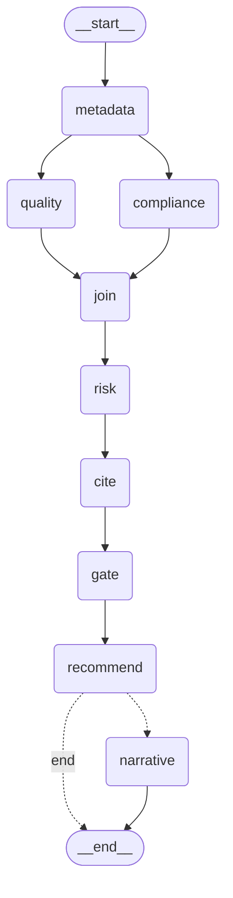

# Enterprise Data Governance Agent — Reference

A complete walkthrough of what this system does, how it is built, and why it is
built that way. Written from the source, not from a design deck: every threshold,
formula and behaviour below was read out of the code.

**Audience:** anyone who needs to understand, extend, review, or demo this
project. Read the [Problem statement](#1-problem-statement) and
[High level design](#2-high-level-design) first; the rest can be read in any order.

---

## Contents

1. [Problem statement](#1-problem-statement)
2. [High level design](#2-high-level-design)
3. [Repository map](#3-repository-map)
4. [Data flow, end to end](#4-data-flow-end-to-end)
5. [The state object](#5-the-state-object)
6. [The agents, one by one](#6-the-agents-one-by-one)
7. [Risk scoring](#7-risk-scoring)
8. [Human in the loop](#8-human-in-the-loop)
9. [The narrative layer](#9-the-narrative-layer-llm)
10. [Policy retrieval (RAG)](#10-policy-retrieval-rag)
11. [The Streamlit demo](#11-the-streamlit-demo)
12. [Datasets](#12-datasets)
13. [Evaluation](#13-evaluation)
14. [Configuration reference](#14-configuration-reference)
15. [Running it](#15-running-it)
16. [Design decisions worth defending](#16-design-decisions-worth-defending)
17. [Known limits](#17-known-limits)

---

## 1. Problem statement

An organisation receives a dataset. Before it can be used, published, or moved
downstream, somebody has to answer four questions:

1. **What is in it?** Which columns exist, what do they actually hold, and which
   of them are business-critical?
2. **Is it fit to use?** Is it complete, unique, well-formed, internally consistent?
3. **Does it contain personal data, and is that data protected?** Not just "is
   there a column called `email`" — personal data hides in mislabeled columns and
   inside free-text notes.
4. **Who has to approve what?** Some findings can be logged and moved past.
   Others must not proceed without a named human accepting them.

Doing this manually is slow, inconsistent between reviewers, and produces no
audit trail. Doing it with a language model alone produces fluent output with
invented numbers — which is worse than no answer, because it is confidently wrong
and unfalsifiable.

**What this system does:** runs the dataset through a set of deterministic
agents that produce scored, evidence-backed findings; routes the serious ones to
a named human for approval; records every step in an append-only audit log; and
*optionally* adds language-model prose on top that explains the findings without
being permitted to change any of the numbers.

---

## 2. High level design

### The one design rule

> **Rules detect. The model explains.**

Every number in the report — every score, every risk value, every count of
affected rows, every routing decision — is produced by deterministic Python. The
language model is never in the path that produces a fact. It writes prose *about*
facts that already exist.

This is not a stylistic preference. It has three concrete consequences:

- **Reproducibility.** The same dataset produces the same scores on every run and
  every machine. A reviewer can re-run and get the same answer.
- **Defensibility.** Every finding can be traced to a rule and a row set. "Why is
  this Critical?" has an arithmetic answer, not a vibe.
- **Graceful degradation.** With no model reachable, the system still produces a
  complete, scored, cited report. You lose the prose, not the product.

### Architecture at a glance

```
CSV ─► profiling ─► catalog ─┬─► quality agent ────┐
                             │                      ├─► join ─► risk ─► cite ─► gate ─► recommend ─┬─► [narrative] ─► report
                             └─► compliance agent ──┘                                              └─────────────────► report
```

Two independent detection branches run in parallel over the same catalog, merge
at a barrier, then pass through a strictly sequential scoring → citation →
routing → recommendation chain. The narrative step is conditional and always last.

### Orchestration: two runners, one implementation

There are two ways to execute the pipeline:

| Runner | Entry point | Notes |
|---|---|---|
| Sequential | `governance/run.py` | Plain Python, calls each node in order |
| Graph | `governance/graph/build.py` | LangGraph `StateGraph`, runs quality + compliance concurrently |

**Both call the exact same node functions** in `governance/graph/nodes.py`. The
graph is a different *wiring* of the same parts, not a second implementation.
`tests/test_graph.py::test_graph_matches_the_sequential_runner` asserts the two
produce identical results — that test is what stops them drifting apart.

### The compiled graph

Generated directly from `build_graph()` (`python -m governance.graph.build --diagram`):



---

## 3. Repository map

```
governance/
├── app.py                  Streamlit dashboard (the demo surface)
├── run.py                  Sequential runner + CLI
├── state.py                GovernanceContext, Finding, CatalogEntry, ... (READ FIRST)
├── config.py               Every threshold, pattern, weight and mapping
├── report.py               Serialisation to governance_report.json + audit log
├── review.py               Human decisions: record, load, decorate (persistent)
├── assistant.py            Scoped Q&A over the report
├── evaluate.py             Precision/recall against the synthetic answer key
├── synthetic.py            Generates the labelled evaluation dataset
├── demo_data.py            Downloads + samples the real UCI dataset
│
├── core/                   THE DETERMINISTIC ENGINE — no LLM anywhere in here
│   ├── profiling.py        Per-column stats, null normalisation
│   ├── types.py            Semantic type inference (the linchpin)
│   ├── quality.py          Four quality dimensions
│   ├── compliance_rules.py Three personal-data detectors
│   ├── masking.py          Deterministic masking preview
│   ├── risk.py             severity × exposure × volume
│   ├── gate.py             Who must approve what
│   └── recommend.py        Remediation drafting
│
├── graph/
│   ├── nodes.py            Every pipeline step as a pure function
│   └── build.py            LangGraph topology + graph runner
│
├── narrative/              THE LLM LAYER — additive, never load-bearing
│   ├── client.py           The only file that talks to a model provider
│   ├── describe.py         Column descriptions + glossary terms
│   ├── explain.py          Plain-English finding explanations
│   ├── recommend.py        Prose around the deterministic recommendations
│   └── summarize.py        Executive summary
│
└── policy/                 REGULATION CORPUS (RAG)
    ├── fetch.py            Pulls regulation text
    ├── chunk.py            Splits into citable chunks
    ├── build.py            Builds the embedding index
    └── retrieve.py         Cosine-similarity search
```

**Suggested reading order for a newcomer:**
`state.py` → `graph/nodes.py` → `core/types.py` → `core/quality.py` →
`core/compliance_rules.py` → `core/risk.py` → `core/gate.py` → `app.py`.

---

## 4. Data flow, end to end

### Step 0 — Load

`run.load(dataset, path)` resolves a dataset name or path to a DataFrame. Raises
`SystemExit` if the file is missing.

> **Gotcha:** `SystemExit` is a `BaseException`, not an `Exception`. Streamlit's
> error handler only catches `Exception`, and a `SystemExit` raised in the
> script-runner's worker thread vanishes silently. `app.py` catches it explicitly
> for this reason — see §11.

### Step 1 — `metadata_node`

- **Deduplicates column names.** A repeated header makes `df[name]` return a
  DataFrame instead of a Series, which crashes profiling. Repeats get a `.1`
  suffix and the rename is recorded in the audit log — visible, not silent.
- **Profiles every column** (`core/profiling.py`): null counts, distinct counts,
  mean length, dtype.
- **Builds the catalog** (`core/types.py`): infers a semantic type per column.

**Semantic type inference is the linchpin of the whole system.** Evidence is
considered in a deliberate order:

1. **Column name** (`NAME_HINTS`) — longest hint wins, so specific beats generic
2. **Values** (regex `PATTERNS`, ≥ `TYPE_INFERENCE_THRESHOLD` = 80% full-match)
3. **dtype** (numeric / datetime)
4. **Length heuristic** (`mean_length > FREETEXT_MIN_MEAN_LENGTH` → `free_text`)
5. Fallback: `categorical`

**Why name evidence comes first:** if the type were inferred purely from values,
and validity were then scored against that inference, the reasoning would be
circular — the type becomes "whatever 80% of values look like" and validity is
100% by construction. Taking type from the name breaks the loop: a column called
`email` is *expected* to hold emails, so the 20% that don't are a genuine defect
rather than a redefinition of the type.

`NAME_ONLY_TYPES` are excluded from value-only inference: a five-digit product
code is indistinguishable from a US postcode by value alone, and guessing wrong
turns a product catalogue into a table of personal data.

Each catalog entry carries a **data class**: `direct_identifier`,
`quasi_identifier`, `pseudonymous_identifier`, or `non_personal`. This drives
exposure in risk scoring.

### Step 2a — `quality_node` (parallel branch)

See §6.1. Produces a `QualityReport` + findings.

### Step 2b — `compliance_node` (parallel branch)

See §6.2. Produces a `ComplianceReport` + findings.

> Both branches append to `issues`, which is why that key carries an
> `operator.add` reducer in the state schema. Without it LangGraph refuses to
> guess how to merge two concurrent writes and raises `InvalidUpdateError`.

### Step 3 — `join_node`

A barrier, not a step. Guarantees both branches finished before anything
downstream assumes `issues` is complete.

### Step 4 — `risk_node`

Scores every finding 0–100 and sorts by descending risk. See §7.

### Step 5 — `cite_node`

Attaches regulation clause text to each finding via semantic search (§10). A
*lookup*, not a generation — the article reference travels with the chunk from
corpus load, so it cannot be invented. Skipped silently with no index; findings
keep their static `ARTICLE_MAP` references, so citations degrade in quality but
never disappear.

### Step 6 — `review_gate`

Assigns `pending_review` or `auto_logged`. See §8.

### Step 7 — `recommend_node`

Drafts a remediation per finding (`core/recommend.py`) — owner, effort, action.

### Step 8 — `narrative_node` *(conditional)*

Only runs when `llm_enabled`. Adds prose. Cannot change any number. See §9.

### Step 9 — Write

`report.write(ctx)` produces:
- `out/governance_report.json` — the full report, regenerated every run
- `out/audit_log.jsonl` — **appended** to, never rewritten

---

## 5. The state object

`GovernanceContext` (`governance/state.py`) is a `TypedDict` threaded through
every node. Each node returns a **partial** update — only keys it changed.

| Key | Reducer | Notes |
|---|---|---|
| `dataset_name`, `dataframe`, `total_rows` | replace | Set at construction |
| `catalog` | replace | Written by `metadata_node` |
| `quality_report`, `compliance_report` | replace | One writer each |
| `issues` | **`operator.add`** | Two concurrent writers — must append |
| `findings` | replace | The settled record after scoring |
| `audit_log` | **`operator.add`** | Every node appends |
| `recommendations`, `executive_summary` | replace | |
| `llm_enabled`, `llm_backend` | replace | Config for the narrative step |

> **Hard-won detail:** `llm_backend` **must be declared in the schema.**
> LangGraph only tracks keys present in the `TypedDict` as channels. A key set
> directly on the dict before `.invoke()` but absent from the schema is silently
> dropped — which made the graph path always fall back to `auto` regardless of
> the requested backend, while the sequential runner (which never calls
> `.invoke()`) worked fine. Undeclared state keys fail *silently*, so if a value
> mysteriously reverts to its default inside the graph, check the schema first.

**Finding identity:** each `Finding` has a stable `id` — a hash of
`(source, issue_type, column, scope)`. Stable across runs is what lets a human
decision made today still attach to the same finding tomorrow.

---

## 6. The agents, one by one

### 6.1 Quality Agent — `core/quality.py`

Four dimensions, each scored 0–100 **and** each producing cell-level findings.
These are independent: a dimension can pass its threshold while still producing
findings, because 25 bad values out of 1,300 is genuinely 98% valid *and*
genuinely 25 things somebody has to fix.

| Dimension | Measure | Threshold | Weight |
|---|---|---|---|
| Completeness | Populated cells ÷ required cells | 95 | 1.0 |
| Uniqueness | 1 − duplicate rate on business key | 99 | 1.0 |
| Validity | Share conforming to expected format | 98 | 1.0 |
| Consistency | One agreed surface form per value + cross-field rules | 95 | 0.5 |

Consistency is weighted lower because it is rule-dependent — it only measures
what someone declared a rule for.

**Findings produced:** `null_heavy_column` (>30% missing), `duplicate_record`,
`invalid_email` / `invalid_format`, `inconsistent_value`.

**Validity detail:** columns with no applicable pattern are excluded from the
denominator entirely, not counted as valid. Counting un-rule-able columns as
valid would inflate the score with columns never actually checked.

**Duplicate exposure detail:** a duplicated row duplicates *everything* in it, so
the exposure of a duplicate finding is driven by the most sensitive column in the
record (`_worst_data_class`), not by duplication being a mundane defect.

#### Accuracy and timeliness are NOT ASSESSED

Deliberately. Accuracy needs a reference dataset to compare against; timeliness
needs an agreed freshness SLA. Neither exists here, so they are reported as
`NOT ASSESSED` with the reason, and **excluded from the headline average**.

> An unmeasured dimension is a known gap. A fabricated score is a defect.

This is a feature, not an omission — it is the design rule applied to the
system's own output.

### 6.2 Compliance Agent — `core/compliance_rules.py`

Three detectors, deliberately kept apart **because they fail differently**:

**1. `classify()` — column level, by name and by value**

Flags whole columns holding personal data. Records evidence as `name`, `value`,
or `name+value`, plus the match rate. Produces `unmasked_pii_column`.

**2. `scan_freetext()` — cell level, inside prose**

Finds personal data written into sentences, where there is no whole-cell pattern
to match — the case a full-value regex can never reach, because the email address
is *inside* the sentence rather than *being* the sentence. Produces
`pii_in_freetext`.

**3. `scan_high_confidence()` — cell level, any rate**

Unmistakable formats (national IDs, card numbers) anywhere, at any rate.

> **Why this exists separately:** a column-level detector needs a match *rate*
> before flagging, otherwise one coincidental match turns every column into
> personal data. But eight national IDs among 500 rows is a rate of 1.6% — below
> any sane threshold, and *exactly the case that matters most*. Formats specific
> enough that a single occurrence is worth reporting bypass the rate test
> entirely. Produces `pii_in_mislabeled_column`.

#### Language matters

This module reports **control gaps, not violations**. Whether processing is
lawful depends on consent, purpose and retention policy — none of which are in a
CSV. What can be demonstrated from the data alone is that personal data is
present and stored in the clear. So that is what it says.

### 6.3 Risk Agent — `core/risk.py` — see §7

### 6.4 Review Gate — `core/gate.py` — see §8

### 6.5 Recommendation Agent — `core/recommend.py`

Drafts a remediation per finding: the action, a suggested owner, an effort
estimate. Deterministic templates keyed on issue type; the narrative layer may
later add prose around them, but the action itself is not model-generated.

---

## 7. Risk scoring

```
risk = severity × exposure × volume_factor,  normalised onto 0–100
```

**Severity (1–5)** — how bad this *kind* of finding is:

| Issue type | Severity |
|---|---|
| `unmasked_pii_column` | 5 |
| `pii_in_freetext` | 5 |
| `pii_in_mislabeled_column` | 5 |
| `null_heavy_column` | 3 |
| `duplicate_record` | 3 |
| `invalid_email` | 2 |
| `invalid_format` | 2 |
| `inconsistent_value` | 2 |

**Exposure (1–3)** — how exposing the data it touches is:

| Data class | Exposure |
|---|---|
| `direct_identifier` | 3 |
| `quasi_identifier` | 2 |
| `pseudonymous_identifier` | 2 |
| `non_personal` | 1 |

> **Exposure is a property of the DATA, not the finding type.** Forty duplicate
> rows in a product-reference table and forty duplicate rows holding customer
> emails are not the same problem. The finding type sets severity; what it
> *touches* sets exposure.

**Volume factor (0.5–1.0):**

```
volume_factor = 0.5 + 0.5 × min(affected_rows / total_rows, 1.0)
```

> **Why the floor exists:** without it, one leaked national ID among 500 rows
> scores near zero, which is plainly wrong. The floor keeps severity dominant and
> lets volume act as an *amplifier* rather than a *veto*.

**Bands:** ≤25 Low · ≤50 Medium · ≤75 High · ≤100 Critical

No language model is involved at any point in `risk.py`, and none ever will be.
Same input, same score, every run, every machine — that is what makes the number
defensible in a review.

---

## 8. Human in the loop

This is a governance system, so the point is not just detection — it is
**accountability for decisions**.

### The gate — `core/gate.py`

Scoring asks *"how bad is this?"*. Gating asks *"who is allowed to decide?"*.
They are separate modules because the threshold between them is a **policy
choice an organisation makes**, and keeping it in its own file makes that visible.

```python
REVIEW_THRESHOLD = 51        # risk ≥ 51 → pending_review, else auto_logged
```

Plus one override: anything with `detection == "llm_unconfirmed"` goes to a human
**regardless of score**. An unconfirmed finding is a question, not a number to
act on.

> **Nothing is ever applied automatically.** The gate decides only whether a
> finding waits for a named human or is recorded and allowed past. No remediation
> is ever executed by this system.

### Decisions — `governance/review.py`

Decisions live in `out/review_decisions.json`, **separate from the report**, for
one reason: the report is regenerated on every run, and a human decision must
outlive the run that produced the finding. Decisions key on the stable finding
id, so a decision made today still attaches to the same finding tomorrow.

**A decision requires a named actor.** `record()` raises `ValueError` on an empty
actor — *"accountability is the point of the gate"*. The dashboard disables the
approve/reject buttons until a reviewer name is entered.

Available actions: **approve**, **reject**, **reopen** (undo, itself audited).

### The audit log — `out/audit_log.jsonl`

Append-only, JSON Lines, opened in append mode and **never rewritten**. Every
node writes an entry; every human decision writes an entry with actor,
timestamp, finding id, and note. This is the artifact that makes the whole
pipeline reviewable after the fact — and, practically, it is also the single best
debugging tool in the system.

---

## 9. The narrative layer (LLM)

Everything under `governance/narrative/`. **Optional, additive, never
load-bearing.** The report is already complete before this step runs.

### What it adds

| Module | Adds |
|---|---|
| `describe.py` | Column descriptions + glossary terms in the catalog |
| `explain.py` | Plain-English explanation of each finding |
| `recommend.py` | Prose around the deterministic recommendations |
| `summarize.py` | Executive summary |

### What it is forbidden from doing

It cannot change severity, risk, band, status, evidence, affected rows, or any
other deterministic field. The guardrail is enforced mechanically, not by
prompting alone: generated text containing numbers **not present in the supplied
facts** is rejected and discarded (`rejected_for_invented_numbers` in the audit
log records this).

### Backends — `narrative/client.py`

The **only** file that talks to a model provider. Swap providers here and nowhere
else.

| Backend | Provider | Key |
|---|---|---|
| `auto` | Local Ollama (`127.0.0.1:11434`) | none |
| `groq` | **Groq** — hosted Llama inference | `GROQ_API_KEY` |
| `grok` | **xAI Grok** — a *different company* | `XAI_API_KEY` |
| `off` | Never calls anything | — |
| `echo` | Marked placeholder text, tests only | — |

> `groq` and `grok` are near-homophones from different companies. The code keys
> them to separate env vars and `tests/test_privacy.py` asserts a key for one can
> never activate the other.

**Key resolution** (`_resolve_secret`): Streamlit secrets first, then environment
(which `python-dotenv` populates from `.env`). Checking `st.secrets` explicitly is
required — Streamlit Cloud does **not** expose its Secrets panel as OS
environment variables.

**Caching:** responses cache to `out/llm_cache.json`, keyed on prompt. A second
run of the same dataset is near-instant.

### Privacy

**No personal data reaches a prompt under any backend.** `describe.py` withholds
sample values for any column classified as personal data; every other prompt
carries only column names, statistics and findings. `tests/test_privacy.py`
asserts this against the real values in the dataset — literal strings, not
patterns that resemble them.

| Backend | Honest claim |
|---|---|
| `auto` (Ollama) | Nothing leaves the machine. |
| `groq` / `grok` | No **personal data** leaves the machine. Prompts do. |

The hosted claim is narrower and still a real control. Say the narrower one.

---

## 10. Policy retrieval (RAG)

`governance/policy/` maps findings to the regulation text behind them.

**Pipeline:** `fetch.py` (pull regulation text) → `chunk.py` (split into citable
chunks, reference travels *with* the chunk) → `build.py` (embed with
`sentence-transformers/all-MiniLM-L6-v2`) → `retrieve.py` (search).

**The search is one matrix multiplication.** Vectors are normalised to length 1,
so cosine similarity collapses to a plain dot product:

```python
sims = matrix @ query          # one score per chunk
```

> **Why no vector database:** at a few hundred chunks, exhaustive comparison is
> both *exact* and *faster* than an approximate index. FAISS and vector DBs exist
> to avoid exhaustive search over millions of vectors; below that threshold they
> add an install dependency, a service to configure and a tuning surface, in
> exchange for a worse answer.

**Why cosine and not distance:** embedding *magnitude* reflects things like text
length rather than meaning. A one-line column description and a three-paragraph
article about the same concept point the same way but have very different lengths.

**Fallback:** with no embedding model, the index degrades to token overlap. That
is meaningfully worse — keyword matching cannot connect `cust_email` to
"information relating to an identifiable person", which is the entire point of
searching semantically. It exists so nothing breaks, not because it is
equivalent, and results report which mode produced them (`backend`,
`degraded_reason` in the audit log).

Citations never fully disappear: without an index, findings keep their static
`config.ARTICLE_MAP` references.

---

## 11. The Streamlit demo

`streamlit run governance/app.py`

### Sidebar

1. **Dataset** — `synthetic`, `online_retail`, or any previously uploaded CSV.
   Upload saves to `data/uploads/<safe_name>.csv` and persists across restarts.
   Filenames are sanitised; reserved names are rejected.
2. **Model settings** — narrative layer toggle, backend radio, LangGraph toggle.
   The backend **defaults to whichever hosted key is actually present**, checked
   via the same `Client(...).available` the pipeline uses.
3. **Reviewer** — name required before any approve/reject is enabled.

### Tabs

| Tab | Shows |
|---|---|
| **Catalog** | Deliverable 1 — every column, type, evidence, classification, empty %, distinct %, description, glossary term |
| **Quality** | Deliverable 2 — dimension scores vs thresholds, failing columns, NOT ASSESSED reasons |
| **Compliance** | Deliverable 3 — personal-data columns, evidence, masking preview, cited clauses |
| **Assistant** | Deliverable 4 — scoped Q&A (§below) |
| **Report** | Deliverable 5 — full findings + recommendations, JSON download |
| **Review queue** | Pending findings with approve/reject, plus the audit log |

The dashboard **reads `out/governance_report.json`**; it does not run the
pipeline unless asked, and it never calls a language model to render a page — all
prose was generated and cached when the report was produced. *A dashboard that
generates text on page load is a dashboard that stalls in front of an audience.*

### The Assistant — `governance/assistant.py`

A **scoped** question-answering surface, not a general chatbot. Two constraints
make that real:

1. Retrieval runs over `governance_report.json` **only**. No access to the
   dataset, the regulation corpus, or anything else. If a fact is not in the
   report, the assistant cannot reach it.
2. Every answer names the finding ids it drew on, and **those ids are attached by
   the retrieval step, not written by the model**. An answer that cites nothing
   retrieved nothing, and says so.

With no model reachable it degrades to showing the matching findings directly —
a worse experience and still a truthful one.

### Deployment gotchas (learned the hard way)

- **`streamlit run governance/app.py` only puts `governance/` on `sys.path`,
  never the project root.** `app.py` inserts the root explicitly at the top —
  without it, `from governance import ...` fails with `ModuleNotFoundError`. A
  command-line workaround (`python -m streamlit`) would fix local runs but *not*
  Streamlit Cloud, which launches the script itself.
- **`SystemExit` is invisible in Streamlit.** Caught explicitly around the run
  button; otherwise a missing dataset makes the button appear to do nothing at all.
- **Streamlit Cloud has no shell**, so `python -m governance.demo_data` cannot be
  run there. The sidebar exposes a "Generate it now" button calling the same
  `demo_data.generate()`.
- **Cloud's filesystem does not persist** across restarts/redeploys. Generated
  datasets and written reports are lost on redeploy and must be regenerated.
- **Cloud secrets ≠ env vars.** Set keys in the app's Settings → Secrets panel;
  `.env` and `.streamlit/secrets.toml` are git-ignored and never reach Cloud.
- **Theme** lives in `.streamlit/config.toml` (native theming) with supplementary
  CSS in `app.py` for what theme keys can't reach (metric cards, bordered
  containers, expanders, dataframe framing).

---

## 12. Datasets

### `synthetic` — the evaluation set

`python -m governance.synthetic` → 500 rows × 14 columns, plus
`ground_truth.json` with **125 labelled defects**:

| Defect | Count |
|---|---|
| `duplicate_record` | 40 |
| `inconsistent_value` | 30 |
| `invalid_email` | 25 |
| `pii_in_freetext` | 12 |
| `pii_in_mislabeled_column` | 8 |
| `unmasked_pii_column` | 7 |
| `null_heavy_column` | 3 |

This is the only dataset with an answer key, so it is the only one precision and
recall can be computed against.

### `online_retail` — the realism set

`python -m governance.demo_data` → downloads UCI Online Retail II (~40MB), takes
a **contiguous** 5,000-row block.

> **Contiguous, not random:** keeping whole invoices together preserves the
> duplicate and return patterns that make the data worth demonstrating on. Random
> sampling would quietly destroy them.

**Why this dataset:** it is messy in ways *nobody chose*. ~25% of rows have no
customer id, quantities go negative for returns, descriptions are inconsistently
cased, rows repeat. Finding defects nobody planted is a far stronger
demonstration than finding the ones you planted yourself.

It also sets up the most interesting finding available: customer ids are already
pseudonymised surrogate numbers — and **a pseudonymous identifier is still
personal data under GDPR Art. 4(5)**, which is very commonly assumed to be false.

No answer key, so it is assessed by manual spot-check rather than precision/recall.

---

## 13. Evaluation

`python -m governance.evaluate` — compares detected findings against
`ground_truth.json`, reporting **precision, recall and F1 per defect type**.

Run `python -m governance.synthetic` first, or there is nothing to evaluate against.

### Test suite — `python -m pytest tests/ -q`

89 tests across nine files:

| File | Guards |
|---|---|
| `test_pipeline.py` | End-to-end pipeline behaviour |
| `test_graph.py` | **Graph output ≡ sequential output** |
| `test_privacy.py` | No personal data in prompts; backend key isolation |
| `test_narrative.py` | Invented numbers rejected; fallbacks |
| `test_policy.py` | Chunking, retrieval, degraded mode |
| `test_surface.py` | Assistant grounding + citation |
| `test_boundary.py` | Edge cases |
| `test_robustness.py` | Malformed input |
| `test_config.py` | Config invariants |

---

## 14. Configuration reference

Everything tunable lives in `governance/config.py`.

| Constant | Value | Meaning |
|---|---|---|
| `TYPE_INFERENCE_THRESHOLD` | 0.80 | Value match rate to infer a type |
| `VALUE_MATCH_THRESHOLD` | 0.05 | Rate above which a column is classified PII by value |
| `NULL_HEAVY_COLUMN_THRESHOLD` | 30.0 | % missing that becomes a finding in itself |
| `THRESHOLDS` | 95/99/98/95 | Pass marks: completeness, uniqueness, validity, consistency |
| `DIMENSION_WEIGHTS` | 1.0/1.0/1.0/0.5 | Headline score weighting |
| `NOT_ASSESSED` | accuracy, timeliness | Never scored, always reported as gaps |
| `SEVERITY` | 1–5 per issue type | Risk input |
| `EXPOSURE` | 1–3 per data class | Risk input |
| `VOLUME_FLOOR` | 0.5 | Stops volume vetoing severity |
| `RISK_BANDS` | 25/50/75/100 | Low, Medium, High, Critical |
| `REVIEW_THRESHOLD` | 51 | Risk at/above this needs a human |
| `CITATION_MIN_SCORE` | — | Minimum similarity to attach a clause |
| `MASK_SALT` | demo salt | **Production should source this from a secret store** |

Also here: `PATTERNS` (regex library), `NAME_HINTS`, `NAME_ONLY_TYPES`,
`DATA_CLASS`, `ARTICLE_MAP`, `ISSUE_ARTICLE_MAP`, `CANONICAL`,
`DATASET_PROFILES` (per-dataset required columns and business keys).

---

## 15. Running it

```bash
# setup
python -m venv .venv
.venv\Scripts\Activate.ps1          # Windows;  source .venv/bin/activate elsewhere
pip install -r requirements.txt

# data
python -m governance.synthetic                    # evaluation dataset
python -m governance.demo_data                    # real dataset (~40MB download)

# run
python -m governance.run --dataset synthetic
python -m governance.run --dataset synthetic --graph
python -m governance.run --dataset online_retail --path data/demo/online_retail.csv

# with prose
python -m governance.run --dataset synthetic --llm --backend groq
python -m governance.run --dataset synthetic --llm --backend grok

# policy corpus
python -m governance.policy.fetch
python -m governance.policy.build

# evaluate + test
python -m governance.evaluate
python -m pytest tests/ -q

# dashboard
streamlit run governance/app.py

# graph diagram
python -m governance.graph.build --diagram
```

**API keys** — either `.env` (no quotes: `GROQ_API_KEY=gsk_...`) or
`.streamlit/secrets.toml` (quotes: `GROQ_API_KEY = "gsk_..."`). Both git-ignored.
On Streamlit Cloud, use Settings → Secrets instead.

---

## 16. Design decisions worth defending

These are the ones an interviewer or reviewer will probe.

**Why not let the model do the detection?** Because then no number is
reproducible, no finding is traceable to a rule, and the whole report becomes
unfalsifiable. The model is fluent about things that are not true; the rules are
not. Rules detect, the model explains.

**Why report NOT ASSESSED instead of scoring accuracy and timeliness?** Because
inventing a number to fill a slot is exactly the failure the whole system exists
to prevent. Applying the design rule to our own output is the point.

**Why is exposure a property of the data rather than the finding?** Forty
duplicate rows in a product table and forty duplicate customer records are not
the same problem, and a scoring scheme that can't tell them apart is not measuring
risk.

**Why does volume have a floor?** Without it, a single leaked national ID among
500 rows scores near zero. Volume should amplify severity, not veto it.

**Why three separate PII detectors?** Because they fail differently. Rate-based
column detection misses the eight national IDs hidden in 500 rows — which is the
case that matters most. Whole-value regex can't see an email inside a sentence.
Each detector exists to cover a specific blind spot in the others.

**Why name-first type inference?** To break the circularity that would make
validity 100% by construction.

**Why two runners?** The sequential one is readable and debuggable; the graph one
gets real parallelism and explicit topology. One shared implementation plus an
equivalence test means keeping both costs almost nothing.

**Why no vector database?** At a few hundred chunks, exhaustive search is exact
*and* faster. A vector DB would add dependencies and a tuning surface for a worse
answer.

**Why do decisions live outside the report?** The report is regenerated every
run; a human decision has to outlive the run that produced the finding.

**Why does a decision require a name?** Accountability is the entire point of a
review gate. An anonymous approval is not a control.

---

## 17. Known limits

Being explicit about these is part of the design rule.

- **Accuracy and timeliness are never measured.** By design, but they *are*
  genuine gaps in coverage — a dataset could be complete, unique, valid,
  consistent and still wrong or stale.
- **Consistency only measures declared rules.** Undeclared inconsistencies are
  invisible; the dimension is weighted 0.5 partly for this reason.
- **Detection is pattern-based.** Novel PII formats, non-Western name/address
  conventions, and languages other than English are weakly covered. `PATTERNS`
  and `NAME_HINTS` are English- and largely US/UK-shaped.
- **`MASK_SALT` is a hardcoded demo value.** Production must source it from a
  secret store.
- **No lineage, no cross-dataset joins, no streaming.** Single-file, single-run.
- **The policy corpus is small and curated.** Retrieval quality is bounded by
  what was fetched and chunked, not by the whole regulation.
- **Nothing is ever remediated.** The system recommends and routes; applying a
  fix is out of scope entirely.
- **Streamlit Cloud does not persist state.** Reports, uploads and generated
  datasets vanish on redeploy.
- **`online_retail` has no answer key**, so its findings are spot-checked, not
  measured.